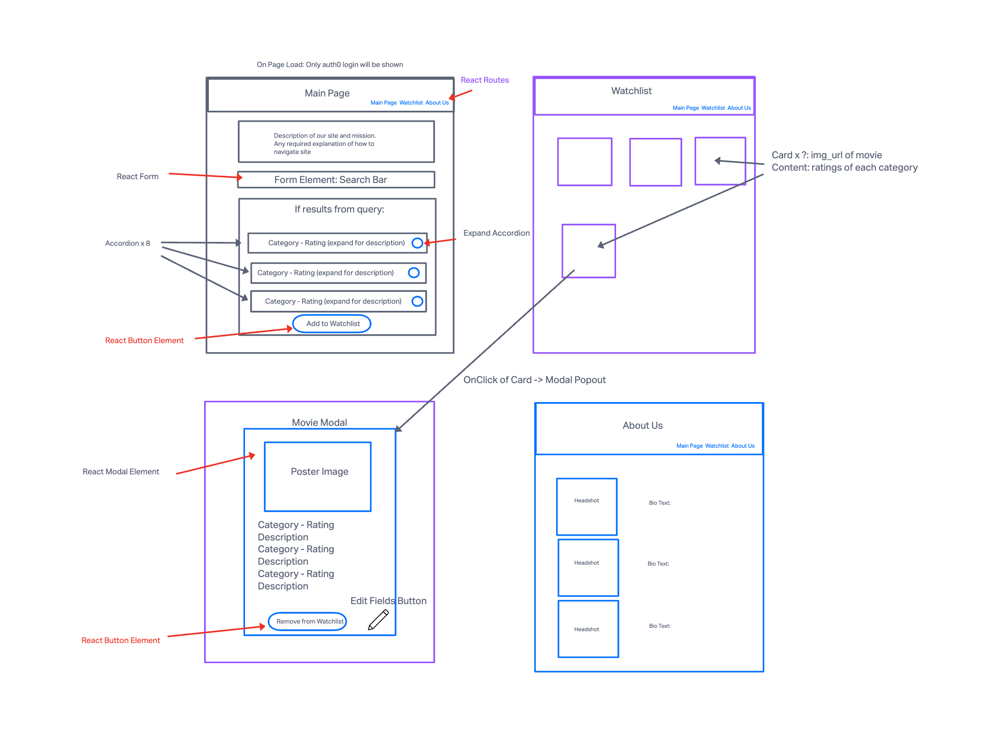
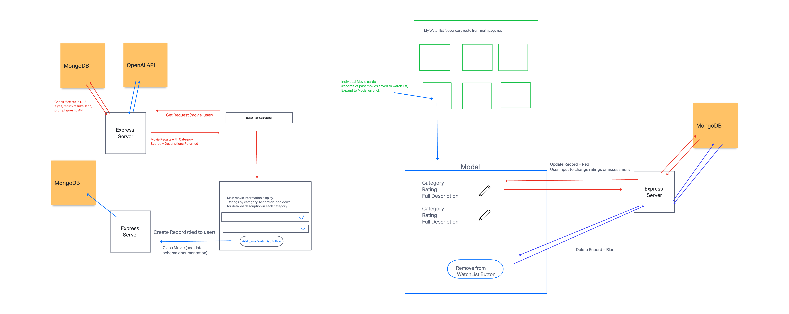
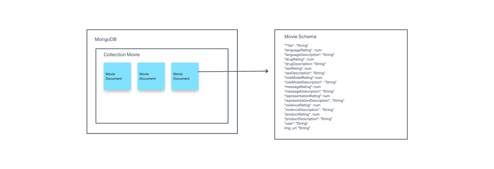

# CineWatch

[https://cinewatch-ai.netlify.app/](https://cinewatch-ai.netlify.app/)

`CineWatch` is a movie-watchlist application, augmented by an OpenAI-powered movie search that offers detailed reviews tailored to age appropriateness. It empowers users to make informed choices about the movies they plan to watch, understand potential content concerns, and manage personalized watchlists.

## Features

### 1. AI-Powered Movie Search:

* Users can search for movies or shows.
* Retrieve detailed AI-generated reviews, evaluating aspects like language, drug use, portrayal of relationships, role models, diversity, violence, and more, all tailored to specific age groups.
* Option to avoid spoilers in reviews.

### 2. User Authentication:

* Securely log in using Auth0.

### 3. View & Manage Watchlist:

* Users can view their personal list of movies they intend to watch.
* Movies can be saved directly to the watchlist from search results.

### 4. Movie Details: 

* Expanded view with movie images and comprehensive content evaluations.

### 5. Content Warnings:

* For each movie, users can view and edit content warnings across different categories.

### 6. Responsive Design:

* Optimal user experience on various screen sizes.

## Technologies Used

* React.js
* Node.js
* MongoDB
* OpenAI API for AI-powered movie reviews
* Auth0 for authentication
* Axios for HTTP requests
* Bootstrap for styling and responsive design

## Usage

### 1. Search for a Movie or Show:

* Enter the name of the movie or show in the search bar.
* Select the age range for which you want the content review.
* Optionally, toggle the "Avoid Spoilers?" switch if you prefer to not receive any spoilers in the review.
* Click the "Search" button.

### 2. View AI-Generated Reviews:

* After searching, an AI-generated review will be displayed in various categories.
* The review evaluates multiple aspects of the movie, offering insights tailored to the selected age range.

### 3. Add to Watchlist:

* Based on the review, if you decide to watch the movie or show, click the "Add to Watch List" button to save it to your personal list.

### 4. Access Personalized Watchlist:

* Navigate to your profile to view and manage your watchlist.

## License

This project is licensed under the MIT License.

## Acknowledgements

- OpenAI for powering the movie content reviews with AI.
- Auth0 team for their authentication solutions.

## Team Members: Aaron Clark, Jon Stillson, Jennifer Sung

## Wire Frame

## Domain Model

## Data Schema

